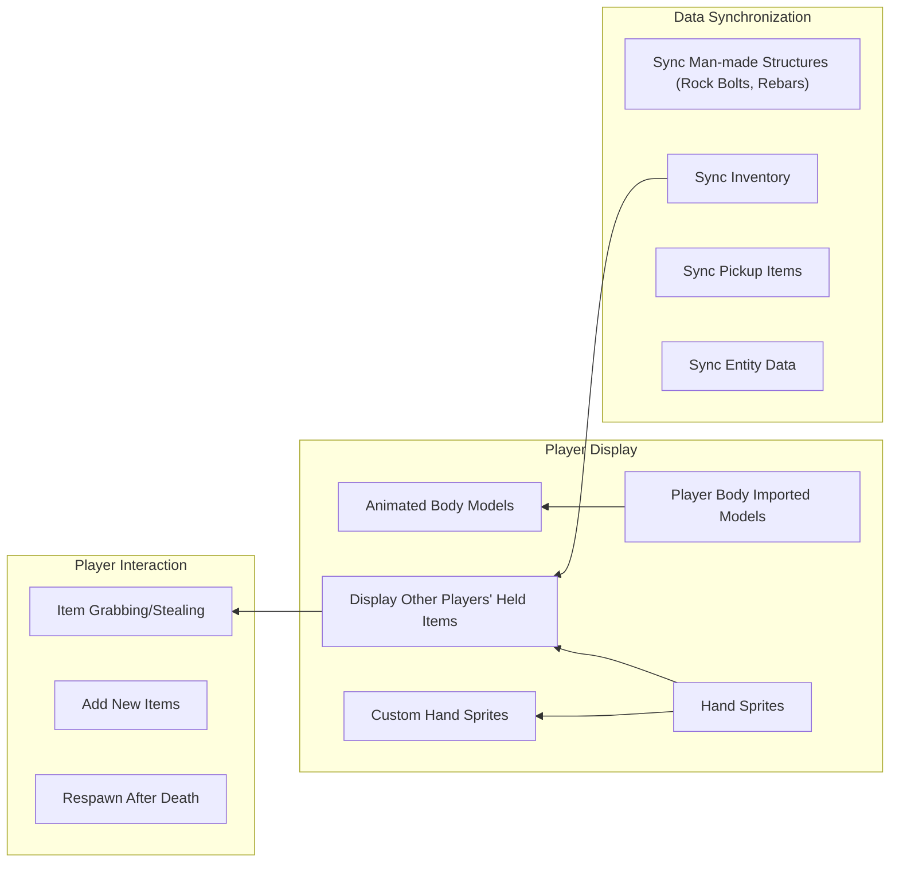

# White Knuckle Multi Player Mod - White Knuckle Online MOD

**[中文](README_CN.md)** | **English**

## Overview

This is a Unity MOD for the game  *White Knuckle* , implementing basic networked player mapping (currently only maps grabbable player capsules).

 **Important Disclaimer** :

* **I am not a Unity/C# developer by profession.**
* **Some code in this project is AI-generated.**
* Consequently,  **the quality of much of the code is likely very poor** . Please use with caution.
* The online multiplayer functionality code is  **forked from a previous online mod project** .
* You are **solely responsible for assessing and bearing any risks** (including but not limited to security and stability issues) associated with using this MOD for development or hosting multiplayer ports.

**Known Issues:**

* Chaotic object lifecycle management, which may lead to unexpected behavior.
* Currently only supports mapping player capsules; synchronization for other objects is not yet implemented.

**Potential Future Goals:**



---

## Installation

Download the required `.dll` files from the [Releases](https://github.com/Shen-X-L/WKMultiMod/releases) page and place them into the `BepInEx/plugins` directory within your game folder.

## Quick Start

### Prerequisites

1. **Game** : *White Knuckle b-0.52a*
2. **Framework** : [BepInEx](https://github.com/BepInEx/BepInEx) (Use a version compatible with your game version)

### Installation Steps

**bash**

```
# 1. Clone this repository locally
git clone https://github.com/Shen-X-L/WKMultiMod.git

# 2. Build the MOD
# Method A: Open and build WhiteKnuckleMod.sln in Visual Studio
# Method B: Use the command line
dotnet build -c Release
```

### Manual Installation

1. Copy the built `WhiteKnuckleMod.dll` file into your game directory's `BepInEx\plugins\` folder.
2. Copy the dependency `LiteNetLib.dll` file to the same `BepInEx\plugins\` folder.
3. Launch the game and check the BepInEx console or log files to confirm the MOD loaded successfully.

## Project Structure

**text**

```
WhiteKnuckleMod/
├── src/
│   ├─ Component/
│   │   └─ Component.cs              # Component class, handles network data
│   ├─ Core/
│   │   ├─ LocalPlayerManager.cs     # Local player info packaging class
│   │   ├─ MPCore.cs                 # Core class, handles main events
│   │   ├─ MPMain.cs                 # Startup class, initializes patches
│   │   └─ RemotePlayerManager.cs    # Remote player object management
│   ├─ Data/
│   │   ├─ DataEnum.cs               # Enum definitions
│   │   └─ PlayerData.cs             # Player network data + serialization utils
│   ├─ NetWork/
│   │   ├─ MPLiteNet.cs              # (Currently deprecated)
│   │   ├─ MPSteamworks.cs           # Separated Steam networking logic
│   │   └─ NetworkEvents.cs          # Network event bus
│   ├─ Patch/
│   │   └─ Patch.cs                  # Patches for interception/injection
│   └─ Util/
│       ├─ TickTimer.cs              # Debug output frequency counter
│       └─ TypeConverter.cs          # String-to-bool utility
├── lib/                            # External dependencies (add manually)
│   └── README.md                   # Dependency acquisition guide
├── WhiteKnuckleMod.sln
├── WhiteKnuckleMod.csproj
└── README.md
```

## Development Guide

### Environment Setup

1. **Install .NET SDK** : Download and install from the [Microsoft .NET website](https://dotnet.microsoft.com/).
2. **Restore NuGet Packages** : Run `dotnet restore` in the project root directory.
3. **Obtain Game DLLs** : It is essential to follow the instructions in `lib/README.md` to acquire the necessary game DLL files and place them in the `lib/` directory.

### Dependency Notes

Compiling this project requires referencing some DLL files from the game itself ( **these files are copyrighted and must NOT be committed to this repository** ), primarily including:

* `Assembly-CSharp.dll`
* `UnityEngine.dll`
* `UnityEngine.CoreModule.dll`
* etc. (See `lib/README.md` for details).

### Key Build Configuration

The project file (`WhiteKnuckleMod.csproj`) is configured with key references and build targets, ensuring `TargetFramework` is set to `netstandard2.1` and allowing unsafe code.

## MOD Features Details

## Multiplayer Functionality

### Version 0.13/0.14

After enabling cheat mode (`cheats`) in-game, use the following commands:

* `host <lobby_name> [max_players]` - Create a lobby.
  * Example: `host abcde`
* `getlobbyid` - Get the lobby room code.
* `join <room_code>` - Join a lobby using the room code.
  * Example: `join 109775241951624817`
* `talk <text>` - Speak via the overhead label.
  * Example: `talk help me`
* `tpto <steamId(suffix match)>` - Teleport between players
  * Example: `tpto 22 (target ID: 561198279116422)`
### Version 0.12

After enabling cheat mode (`cheats`) in-game, use the following commands:

* `host <port> [max_players]` - Host a server.
  * Example: `host 22222`
* `join <ip_address> <port>` - Join an existing host server.
  * Example: `join 127.0.0.1 22222` or `join [::1] 22222`
* `leave` - Leave the current host server.

### Configuration Options

shenxl.MultiPlayerMod.cfg 中
```
[Debug]

## 值为0时使用中文输出日志, Use English logs when the value is 1.
# Setting type: Int32
# Default value: 1
LogLanguage = 0
```
## Contributing

Welcome to submit Issues for bug reports or suggestions! Pull Requests are also welcome.

 **Reminder** : The code quality in this project is inconsistent, and some is AI-generated. Please keep this in mind when contributing.

### Contribution Process

1. Fork the repository.
2. Create your feature branch (`git checkout -b feature/YourAmazingFeature`).
3. Commit your changes (`git commit -m 'Add some AmazingFeature'`).
4. Push to the branch (`git push origin feature/YourAmazingFeature`).
5. Open a Pull Request.

### Code Style Suggestions

* Try to follow common C# naming conventions.
* Add comments to explain critical sections.
* Please test new features thoroughly.

## Important Copyright Notice:

* The game *White Knuckle* and its related DLL files are copyright of their respective developers/publishers.
* Use of this MOD requires you to own a legitimate copy of the game  *White Knuckle* .

## Acknowledgments

* **[Harmony](https://github.com/pardeike/Harmony)** - A powerful .NET runtime patching library.
* **[BepInEx](https://github.com/BepInEx/BepInEx)** - An excellent plugin framework for Unity games.
* ***White Knuckle* Game Community** - For inspiration and testing assistance.
* **Original Online Mod Author(s)** - For laying the groundwork with their open-source code.

## Contact

* **GitHub Issues** : [Submit issues or suggestions here](https://github.com/your-username/repo-name/issues)
* **Discord** : [https://discord.com/invite/f2CqdmUSap](https://discord.com/invite/f2CqdmUSap)
* **QQ Group** : 596296577
* **Author** : Shenxl - 819452727@qq.com
