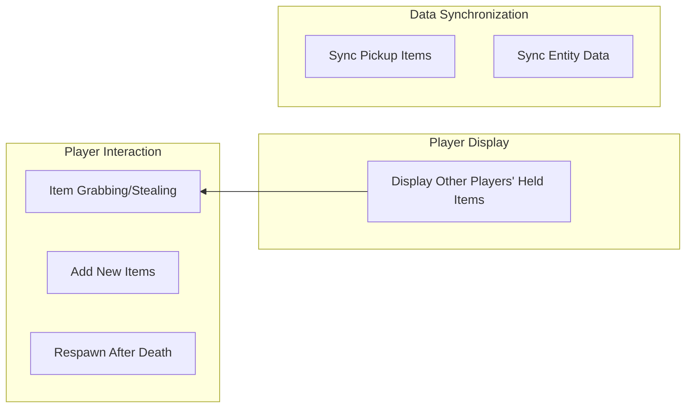

# White Knuckle Multi Player Mod - White Knuckle Online MOD

__[中文](README_CN.md)__ | __English__

## Overview

This is a Unity MOD for the game  *White Knuckle* , implementing basic networked player mapping (currently only maps grabbable player capsules).

**Important Disclaimer** :

* **I am not a Unity/C# developer by profession.**
* **Some code in this project is AI-generated.**
* Consequently,  **the quality of much of the code is likely very poor** . Please use with caution.
* The online multiplayer functionality code is  **forked from a previous online mod project** .

**Known Issues:**

* Chaotic object lifecycle management, which may lead to unexpected behavior.

**Potential Future Goals:**


```mermaid
graph RL
    %% Module 1: Player Display
    subgraph Player Display
        1d[Display Other Players' Held Items]
    end

    %% Module 2: Player Interaction
    subgraph Player Interaction
        2b[Item Grabbing/Stealing]
        2c[Add New Items]
        2e[Respawn After Death]
    end

    %% Module 3: Data Synchronization
    subgraph Data Synchronization
        3c[Sync Pickup Items]
        3e[Sync Entity Data]
    end

    %% Dependency Connections (cross-module and within modules)
    1d --> 2b
```

---

## Installation

### Prerequisites

1. **Game** : White Knuckle
2. **Framework** : [BepInEx](https://github.com/BepInEx/BepInEx) (Use a version compatible with your game version)

### Installation Steps

Download the required `.zip` file from the [Releases](https://github.com/Shen-X-L/WKMultiMod/releases) page, then extract it into the `BepInEx/plugins` folder in your game directory.

## MOD Features Details

### Multiplayer Functionality

### 1.5.0

**New Commands:**

* `host <name> [visibility] [max_players]` – Create a lobby. For visibility options, see the `lobbytype` command.
  * Example: `host abcde` `host aaa friends 3`
* `join <name/lobby_code>` – Join a lobby by lobby name or lobby code. The parameter is first matched against lobby names. If multiple lobbies share the same name, joining by name will fail; please use the lobby code instead.
  * Example: `join abcde` `join 109775241951624817`
* `leave` – Leave the current lobby.
* `lobbyid` – Get the lobby code and copy it to the clipboard.
* `allplayer` – Get a list of all players and their Steam IDs.
* `talk <text>` – Speak in chat (text appears above your head and in the console). Currently, the console does not support Chinese characters.
  * Example: `talk hello` `talk I have the highland`
* `lobbylist` – Get information about all available lobbies, including lobby codes and current player counts.
* `setlobbyname <name>` – Change the lobby name. Host only.
  * Example: `setlobbyname newname`
* `changemodel <model_name>` – Change the remote player model (does not take effect mid‑game). Currently supports `default` and `slugcat`.
  * Example: `changemodel slugcat`
* `lobbytype [public/private/friends]` – Change lobby visibility. `public` = anyone can join, `private` = joinable only via lobby code, `friends` = visible and joinable only by friends.
  * Example: `lobbytype friends`
* `invite` – Invite a friend to join the lobby. (Thanks to Fugel for the code.)
* `allowcheats` – Control whether cheat commands can be used in the lobby. If set to `false`, cheat mode and noclip are forcibly disabled.
  * Example: `allowcheats false` `allowcheats true`
* `allowpvp` – Control whether players can damage each other.
  * Example: `allowpvp false` `allowpvp true`

**Commands available after enabling cheat mode (`cheats`) in-game:**

* `tpto <steamId (suffix matching)>` – Teleport to another player. Supports autocompletion.
  * Example: `tpto 16422` or `tpto 22` (for target Steam ID 561198279116422)

### Version 0.12(No longer updated)

After enabling cheat mode (`cheats`) in-game, use the following commands:

* `host <port> [max_players]` - Host a server.

   * Example: `host 22222`

* `join <ip_address> <port>` - Join an existing host server.

   * Example: `join 127.0.0.1 22222` or `join [::1] 22222`

* `leave` - Leave the current host server.

## Development Guide

### Source Code Construction

**bash**

```sh
# 1. Clone this repository locally
git clone https://github.com/Shen-X-L/WKMultiMod.git

# 2. Build the MOD
# Method A: Open and build WhiteKnuckleMod.sln in Visual Studio
# Method B: Use the command line
dotnet build -c Release


```

### Project Structure

**text**

```ini
WhiteKnuckleMod/
├── src/Core/                       # Mod core logic
│   ├─ Asset/
│   │   └─ MPAssetManager.cs        # Retrieves game prefabs via Resources.FindObjectsOfTypeAll<GameObject>()
│   ├─ Component/                   # Components that depend on game libraries, cannot be moved to Unity project
│   │   ├─ LocalPlayer.cs           # Component class, responsible for local player positioning
│   │   ├─ NetworkedPiton.cs        # Component class, responsible for rock bolt synchronization
│   │   └─ RemoteEntity.cs          # Component class, responsible for dealing damage to other players
│   ├─ Core/
│   │   ├─ MPConfig.cs              # Reads configuration file data
│   │   ├─ MPCore.cs                # Core class, handles main events
│   │   ├─ MPGameModeManager.cs     # Manages network-transmittable game mode data and loads corresponding game modes
│   │   └─ MPMain.cs                # Startup class, initializes patches
│   ├─ Data/
│   │   ├─ DataReader.cs            # Reads data from ArraySegment<byte>/byte[]
│   │   ├─ DataWriter.cs            # Writes data to ArraySegment<byte>
│   │   ├─ MPDataPool.cs            # Manages thread-isolated read/write object pools to avoid frequent memory allocation
│   │   ├─ MPEventBusGame.cs        # In-game data bus, handles in-game event publishing and subscription
│   │   └─ MPEventBusNet.cs         # Network data bus, facilitates communication between MPCore and MPSteamworks
│   ├─ NetWork/
│   │   ├─ MPLiteNet.cs             # IP-based connection (currently deprecated)
│   │   ├─ MPPacketHandler.cs       # Class for processing received data packets, dispatches data based on protocol
│   │   ├─ MPPacketRouter.cs        # Builds packet type → handler function dictionary via reflection, calls handler based on packet type
│   │   └─ MPSteamworks.cs          # Separated Steam networking logic class
│   ├─ Patch/
│   │   ├─ Patch.cs                 # Patches for Miscellaneous patches (e.g., map sync via unlock progress and disabling flipping)
│   │   ├─ Patch_CommandConsole.cs  # Patches for command registration, cheat disabling, and fixing string output in the console
│   │   ├─ Patch_ENT_Player.cs      # Patches for capturing player events
│   │   ├─ Patch_PitonSync.cs       # Patches for capturing rock bolt events
│   │   └─ Patch_SteamManager.cs    # Patches for initializing MPCore via SteamManager lifecycle
│   ├─ RemotePlayer/
│   │   ├─ Factory/
│   │   │   ├─ BaseRemoteFactory.cs # Base class for remote object factories, provides interface for creating remote objects by cloning prefabs
│   │   │   └─ SlugcatFactory.cs    # Factory class with special handling for Slugcat prefab model
│   │   ├─ RPContainer.cs            # Handles data updates and lifecycle for a single remote player object
│   │   ├─ RPFactoryManager.cs       # Creates remote player objects and adds them to RPManager for management
│   │   └─ RPManager.cs              # Manages data updates and lifecycle for all remote player objects
│   ├─ Test/
│   │   ├─ Test.cs                  # Non-game-impacting test functions, allows quick modifications
│   │   └─ TestMonoSingleton.cs     # Test MonoSingleton, allows quick modifications
│   ├─ UI/
│   │   ├─ Patch_UI.cs              # Patches for adding the Multi Play button when the game mode menu initializes
│   │   ├─ UI_LoadingDisplay.cs     # Loading screen component (supports timed auto‑hide, immediate hide, and delayed hide)
│   │   ├─ UI_LobbyCreateButton.cs  # Component for the "Create Lobby" button (quickly creates a lobby and starts the game from the game mode menu)
│   │   ├─ UI_LobbyButton.cs        # Lobby option button component, handles the join lobby button functionality
│   │   ├─ UI_LobbyListPane.cs      # Lobby list panel component, displays the lobby list UI
│   │   └─ UI_Manager.cs            # UI Manager, creates and manages UI interfaces
│   ├─ Util/ 
│   │   ├─ Localization/       
│   │   │   ├─ Localization.cs      # Localization utility class, retrieves localized console text
│   │   │   ├─ json_sort.py         # Sorts JSON files in the Localization folder
│   │   │   ├─ texts_en.json        # English texts
│   │   │   └─ texts_zh.json        # Chinese texts
│   │   ├─ MonoSingleton.cs         # Base class for Unity component singletons, provides singleton pattern implementation for Unity
│   │   └─ Singleton.cs             # Base class for regular singletons, provides generic singleton pattern implementation
│   ├─ World/
│   │   └─ PitonSyncManager.cs      # Manages creation, movement, and drop event synchronization for rock bolts
│   └─ LocalPaths.props.example     # Configuration file that defines local library reference paths for building the project, independent of the source tree
├── src/Shared/                     # Extracted Unity component logic for sharing with Unity project for rapid prefab construction
│   ├─ Component/                   # Components usable in Unity project
│   │   ├─ LookAt.cs                # Forces label to face player, scales label to maintain constant size
│   │   ├─ ObjectIdentity.cs        # Identifies the factory ID that created this object, used for proper destruction
│   │   ├─ RemoteHand.cs            # Controls hand position via network data
│   │   ├─ RemotePlayer.cs          # Controls player position via network data
│   │   ├─ RemoteTag.cs             # Controls label content via network data
│   │   └─ SimpleArmIK.cs           # Uses IK to connect arm to hand
│   ├─ Data/ 
│   │   ├─ HandData.cs              # Hand position data
│   │   └─ PlayerData.cs            # Player position data
│   ├─ MK_Component/                # Game-internal components, cannot be directly assigned, handled via mapping components
│   │   ├─ MK_CL_Handhold.cs        # Mapping for in-game CL_Handhold
│   │   ├─ MK_ObjectTagger.cs       # Mapping for in-game ObjectTagger
│   │   └─ MK_RemoteEntity.cs       # Mapping for mod's RemoteEntity
│   ├─ Util/ 
│   │   ├─ DictionaryExtensions.cs  # Dictionary utility class, provides suffix matching, set difference operations, etc.
│   │   └─ TickTimer.cs             # Debug output frequency controller
│   └─ LocalPaths.props.example     # Configuration file that defines local library reference paths for building the project, independent of the source tree
├── lib/                            # External dependency directory (must be added manually)
│   └── README.md                   # Dependency acquisition guide
├── WhiteKnuckleMod.sln             # Visual Studio solution file
└── README.md                       # This document


```

### Environment Setup

1. **Install .NET SDK** : Download and install from the [Microsoft .NET website](https://dotnet.microsoft.com/).
2. **Restore NuGet Packages** : Run `dotnet restore` in the project root directory.
3. **Obtain Game DLLs** : It is essential to follow the instructions in `lib/README.md` to acquire the necessary game DLL files and place them in the `lib/` directory.

## Contributing

Welcome to submit Issues for bug reports or suggestions! Pull Requests are also welcome.

**Reminder** : The code quality in this project is inconsistent, and some is AI-generated. Please keep this in mind when contributing.

### Contribution Process

1. Fork the repository.
2. Create your feature branch (`git checkout -b feature/YourAmazingFeature`).
3. Commit your changes (`git commit -m 'Add some AmazingFeature'`).
4. Push to the branch (`git push origin feature/YourAmazingFeature`).
5. Open a Pull Request.

### Code Style Suggestions

* Try to follow common C# naming conventions.
* Add comments to explain critical sections.
* Please test new features thoroughly.

## Important Copyright Notice:

* The game *White Knuckle* and its related DLL files are copyright of their respective developers/publishers.
* Use of this MOD requires you to own a legitimate copy of the game  *White Knuckle* .

## Acknowledgments

* **[Harmony](https://github.com/pardeike/Harmony)** - A powerful .NET runtime patching library.
* **[BepInEx](https://github.com/BepInEx/BepInEx)** - An excellent plugin framework for Unity games.
* **[Time](https://github.com/TimeCr)** - Implemented numerous features, including rock bolt synchronization, dropped item synchronization, and entity synchronization (some features are still under testing).
* **[Fugel](https://github.com/PotatoeShaman)** - Provided APIs for Steam friend invites, receiving invites, and in‑game UI display.
* ***White Knuckle* Game Community** - For inspiration and testing assistance.
* **Original Online Mod Author(s)** - For laying the groundwork with their open-source code.
* **QQ Group and Discord** – Provided bug reports and mod improvement ideas.

## Contact

* **GitHub Issues** : [Submit issues or suggestions here](https://github.com/your-username/repo-name/issues)
* [**White Knuckle Discord**](https://discord.com/invite/f2CqdmUSap)
* [**Multi Player Mod Discord**](https://discord.gg/huHkf6ChcV)
* **QQ Group** : 596296577
* **Author** : Shenxl - 819452727@qq.com
