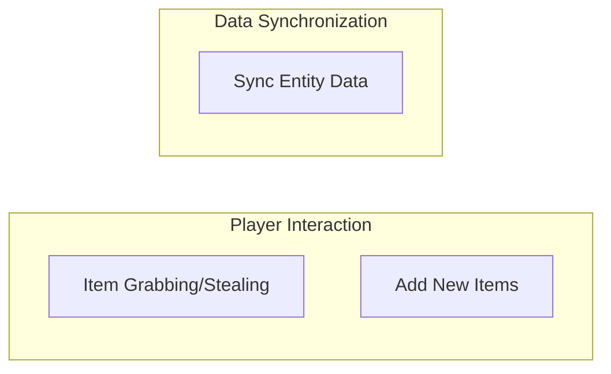

# White Knuckle Multi Player Mod - White Knuckle Online MOD

**[中文](README_CN.md)** | **English**

## Overview

This is a Unity MOD for the game  *White Knuckle* , implementing basic networked player mapping (currently only maps grabbable player capsules).

**Important Disclaimer** :

* **I am not a Unity/C# developer by profession.**
* **Some code in this project is AI-generated.**
* Consequently,  **the quality of much of the code is likely very poor** . Please use with caution.
* The online multiplayer functionality code is  **forked from a previous online mod project** .

**Known Issues:**

* Chaotic object lifecycle management, which may lead to unexpected behavior.

**Potential Future Goals:**


```mermaid
graph RL
    %% Module 2: Player Interaction
    subgraph Player Interaction
        2b[Item Grabbing/Stealing]
        2c[Add New Items]
    end

    %% Module 3: Data Synchronization
    subgraph Data Synchronization
        3e[Sync Entity Data]
    end
```

**Completed Goals**:

* Player position sync
* Player map sync – map remains the same after disk resurrection (please make good use of disk resurrection). Shortcut map sync is also supported (unstable, needs refactoring).
* Player vs. Player (PvP) and configurable PvP damage
* Players drop items upon death
* UI-based multiplayer lobby
* Player team grouping
* Climbable object sync (pitons, rebars, etc.)
* Scene item pickup sync
* Player-dropped item sync
* Death sync
* Entity data sync (semi-finished, needs further work)

---

## Installation

### Prerequisites

1. **Game** : White Knuckle
2. **Framework** : [BepInEx](https://github.com/BepInEx/BepInEx) (Use a version compatible with your game version)

### Installation Steps

Download the required `.zip` file from the [Releases](https://github.com/Shen-X-L/WKMultiMod/releases) page, then extract it into the `BepInEx/plugins` folder in your game directory.

## MOD Features Details

### Multiplayer Functionality

### 1.8.1

All new commands:

**Player Customization:**

* `playername <name>` – Set an additional display name.
* `playercolor <preset>/<RGB values>` – Set the player's color.
  * Example: `playercolor white` – Set to white using a preset. `playercolor 255 255 255` – Set to white using RGB values.
* `playermodel <model name>` – Change the remote player model. Currently supports `default` and `slugcat`.
  * Example: `playermodel slugcat`

**Lobby Management:**

* `host <name> [visibility] [max_players]` – Create a lobby. For visibility options, see the `lobbytype` command.
  * Example: `host abcde` `host aaa friends 3`
* `join <name|lobby_code>` – Join a lobby by lobby name or lobby code. The parameter is first matched against lobby names. If multiple lobbies share the same name, joining by name will fail; please use the lobby code instead.
  * Example: `join abcde` `join 109775241951624817`
* `leave` – Leave the current lobby.
* `lobbyid` – Get the lobby code and copy it to the clipboard.
* `lobbylist` – Get information about all available lobbies, including lobby codes and current player counts.
* `lobbytype [public|private|friends]` – Host only. Change lobby visibility. `public` = anyone can join, `private` = joinable only via lobby code, `friends` = visible and joinable only by friends.
  * Example: `lobbytype friends`
* `lobbyname <name>` – Host only. Change the lobby name.
  * Example: `lobbyname newname`
* `hostset <steamId (suffix matching)>` – Host only. Transfer host privileges.
  * Example: `hostset 16422` or `hostset 22` (for target Steam ID 561198279116422)

**Other Commands:**

* `allplayer` – Get the distance, position, and Steam ID of all connected players.
* `talk <text>` – Speak in chat (text appears above your head and in the console). Chinese characters may require a font patch.
  * Example: `talk hello` `talk I have the high ground`
* `subtitletalk <text>` – Display a message via subtitles.
  * Example: `subtitletalk hello` `subtitletalk You underestimate my power`
* `invite` – Invite a friend to join the lobby. (Thanks to Fugel for the code.)
* `tpto <steamId (suffix matching)>` – Requires `cheats`. Teleport to another player. Supports autocompletion.
  * Example: `tpto 16422` or `tpto 22` (for target Steam ID 561198279116422)
* `check <check_target> [steamId (full match)]*n` – Check other players for: backpack items `inventory`, perks `perk`, stamina `stamina`, health `health`, cheat mode `cheats`.
  * Example: `check inventory 561198279116422`

**Rule Controls:**

* `allowcheats [true|false]` – Host only. Control whether cheat commands can be used in the lobby. If set to `false`, cheat mode and noclip are forcibly disabled.
  * Example: `allowcheats false` `allowcheats true`
* `allowpvp [true|false]` – Host only. Control whether players can damage each other.
  * Example: `allowpvp false` `allowpvp true`
* `pvprule ([Rules] [Value])*n` – Host only. Configure lobby damage and related settings (invincibility frames, burn damage duration, etc.).
  * Example: `pvprule All 0.1 Melee 5`
* `bindsync [true|false]` – Host only. Controls whether trinkets and bindings are synced for players who join later.
  * Example: `bindsync true`
* `enemysync [true|false]` – Host only. Controls whether creature sync is enabled (semi‑complete).
  * Example: `enemysync true`

**Team Commands:**

* `teamrule <SourceTeam> <TargetTeam> ([Rule] [true|false|default])*n , ...` – Host only. Controls rules between teams.
  * Example: `teamrule hunter runner pvp true hang false grab false , runner hunter pvp false tagshow false`

* `teamrule` available rules:
  * `pvp` – Whether players can damage each other.
  * `hang` – Whether players can drag each other (like pulling a crate).
  * `grab` – Whether players can grab each other (like grabbing a piton).
  * `tagshow` – Whether name tags are displayed above players.
  * `syncsceneitem` – Whether scene items are synced (only one player per rule can pick up scene‑spawned items).
  * `syncdropitem` – Whether dropped items are synced (whether items dropped by a player can be picked up by others under the same rule).
  * `syncinventory` – Whether inventory is synced (not implemented).
  * `syncdied` – Death sync (when one player dies, everyone dies).
  * `collision` – Whether collision is enabled.

* `teamadd <TeamName>` – Host only. Add an active team.
* `teamremove <TeamName>` – Host only. Remove an active team and disable its rules.
* `teamjoin <TeamName>` – Join a team.

**Remote Commands:**

* `pcmd <all|steamId> ; [command1] ; [command2]...` – Host only. Make other remote players execute the commands you input.
  * Example: `pcmd 561198279116422 12345 ; addperk perk_u_t3_peripheralbinding ; spawnentity item_artifact_evaglove`

* `tcmd <TeamName> ; [command1] ; [command2]...` – Host only. Make all players in the specified team execute the commands you input.
  * Example: `tcmd hunter ; addperk perk_u_t3_peripheralbinding ; spawnentity item_artifact_rebar_return`
  * Example: `tcmd runner ; addperk perk_u_t3_peripheralbinding ; spawnentity item_artifact_evaglove`

* `acmd <join|restart|jointeam_TeamName> ; [command1] ; [command2]...` – Host only. Execute commands when players perform certain actions.
  * `acmd` trigger conditions:
    * `join` – Executes the command after a player joins a room and the map has been initialized.
    * `restart` – Executes the command when a player fully dies and restarts, or when the restart button is used.
    * `jointeam_TeamName` – Executes the command when a player joins that team (currently not persistent; it needs to be reset every time the game restarts).
  * Example: `acmd join ; loadlevel xxx ; delay 1s ; deathgoo-height NaN ;`
  * Example: `acmd restart ; addperk perk_u_t3_peripheralbinding ; spawnentity item_artifact_evaglove`
  * Example: `acmd jointeam_hunter ; addperk perk_u_t3_peripheralbinding ; spawnitem item_artifact_evaglove`

**Custom Join/Leave/Death/Win Messages:**
**Edit Death Messages:**
Edit `0_DeathMessage` in `texts_(your language).json`.

* For damage caused by the game itself: `{0}` is the local player's name, and the JSON key is the cause of death — this is optional.
* For damage caused by other remote players: `{0}` is the local player's name, `{1}` is the attacker's name, and the JSON key is `playerKill` + the cause of death — this is also optional.

```json
"0_DeathMessage": {
  "default": [
    "{0} died due to {1}"
  ],
  "teeth": [
    "{0} was chomped and chewed by teeth"
  ],
  "fan": [
    "{0} was torn in half by a fan"
  ],
  "death information": [
    "Custom death message"
  ],
  "playerKillreturnrebar": [
    "{1} sacrificed {0} with an artifact spear"
  ],
},

```

**Edit Join/Leave/Win Messages:**

Edit the `0_DisplayMessage` section in `texts_(your language).json`:

* `EnteredMessages` – Message displayed for the local player when joining
* `InviteReceivedMessages` – Message displayed when inviting someone
* `JoinMessages` – Message displayed when joining a lobby
* `LeaveMessages` – Message displayed when leaving a lobby
* `WinMessages` – Message displayed when winning

Where `{0}` is the player's name.

```json
"0_DisplayMessage": {
  "EnteredMessages": [
    "Joined {0} - {1}/{2}\nid: {3}"
  ],
  "InviteReceivedMessages": [
    "{0} has been invited to the facility",
    "Custom invite message"
  ],
  "JoinMessages": [
    "{0} has been drawn into this world due to a Delta anomaly",
    "{0} has been hired at the facility",
    "{0} has emerged from the mass",
    "{0} has been summoned by Rho",
    "Custom join message"
  ],
  "LeaveMessages": [
    "{0} has been detached from this world due to a Delta anomaly",
    "{0} has been fired from the facility",
    "{0} has been swallowed by the mass again",
    "{0} has been taken away by Rho again",
    "Custom leave message"
  ],
  "WinMessages": [
    "{0} escaped from here",
    "Custom win message"
  ]
}

```

### Version 0.12(No longer updated)

After enabling cheat mode (`cheats`) in-game, use the following commands:

* `host <port> [max_players]` - Host a server.

  * Example: `host 22222`
* `join <ip_address> <port>` - Join an existing host server.

  * Example: `join 127.0.0.1 22222` or `join [::1] 22222`
* `leave` - Leave the current host server.

## Development Guide

### Source Code Construction

**bash**

```bash
# 1. Clone this repository locally
git clone https://github.com/Shen-X-L/WKMultiMod.git

# 2. Build the MOD
# Method A: Open and build WhiteKnuckleMod.sln in Visual Studio
# Method B: Use the command line
dotnet build -c Release

```

### Project Structure

**text**

```ini
WhiteKnuckleMod/
├── src/Core/                       # Mod core logic
│   ├─ Asset/
│   │   └─ MPAssetManager.cs        # Retrieves game prefabs via Resources.FindObjectsOfTypeAll<GameObject>()
│   ├─ Component/                   # Components that depend on game libraries and cannot be moved to Unity project
│   │   ├─ LocalPlayer.cs           # Uploads local player position
│   │   ├─ NetworkedClimable.cs     # Syncs climbable objects created by players
│   │   ├─ NetworkedEnemy.cs        # Host-side creature sync recording
│   │   ├─ NetworkedItem.cs         # Syncs items created by players
│   │   ├─ RemoteEntity.cs          # Handles damage to other players; allows remote player objects to be dragged/attacked
│   │   ├─ RemoteHand.cs            # Syncs hand position of players; handles dragging of local player by remote players
│   │   └─ RPContainerRef.cs        # Remote player object container component; identifies and retrieves RPContainer on remote player objects
│   ├─ Core/
│   │   ├─ InventoryManager.cs      # Inventory item API
│   │   ├─ MPConfig.cs              # Reads configuration file data
│   │   ├─ MPCore.cs                # Core class, handles main events
│   │   ├─ MPGameModeManager.cs     # Defines network-transmittable game mode data and loads corresponding game modes
│   │   └─ MPMain.cs                # Startup class, initializes patches
│   ├─ Data/
│   │   ├─ MPDataPool.cs            # Manages thread-isolated read/write object pools to avoid frequent memory allocation
│   │   ├─ MPEventBusGame.cs        # In-game data bus, handles event publishing and subscription within the game
│   │   ├─ MPEventBusNet.cs         # Network data bus, facilitates communication between MPCore and MPSteamworks
│   │   └─ MPKeys.cs                # Defines common constant strings for lobby data keys, player data events, etc.
│   ├─ NetWork/
│   │   ├─ MPLiteNet.cs             # IP-based connection (currently deprecated)
│   │   ├─ MPPacketHandler.cs       # Processes received data packets, dispatches data based on protocol
│   │   ├─ MPPacketRouter.cs        # Builds packet type → handler function dictionary via reflection, calls handler based on packet type
│   │   └─ MPSteamworks.cs          # Separated Steam networking logic class
│   ├─ Patch/                       # Patch classes and reflection utilities for modifying the game via Harmony
│   │   ├─ Patch.cs                 # Miscellaneous patches (e.g., map sync via unlock progress and disabling flipping)
│   │   ├─ Patch_CL_GameManager.cs  # Handles world offset adjustments
│   │   ├─ Patch_CL_Prop.cs         # Disables most original CL_Prop functionality, keeping only draggable behavior
│   │   ├─ Patch_ClimbableItem.cs   # Handles climbable item events
│   │   ├─ Patch_CommandConsole.cs  # Registers commands, provides reflection interface for console commands
│   │   ├─ Patch_EnemySync.cs       # Handles creature sync
│   │   ├─ Patch_ENT_Player.cs      # Captures player events, forces player to release grabs
│   │   ├─ Patch_ItemSync.cs        # Syncs items
│   │   ├─ Patch_SteamManager.cs    # Initializes MPCore via SteamManager lifecycle
│   │   └─ Patch_WorldLoader.cs     # Stops seed offset on respawn, syncs coordinate offset for branch route generation
│   ├─ RemotePlayer/
│   │   ├─ Factory/
│   │   │   └─ RPPrefabProcessor.cs # Post-processes remote player prefabs (e.g., adding components, modifying materials)
│   │   ├─ RPContainer.cs           # Handles data updates and lifecycle for a single remote player object
│   │   ├─ RPFactoryManager.cs      # Creates remote player objects and adds them to RPManager for management
│   │   └─ RPManager.cs             # Manages data updates and lifecycle for all remote player objects
│   ├─ Team/
│   │   ├─ generate_rules.py        # Python script to generate team rule configurations
│   │   ├─ TeamRule.cs              # Team rule entity and compressed rule API definition class
│   │   ├─ TeamRule.g.cs            # Generated rule enums and rule API (via Python script)
│   │   └─ TeamRuleManager.cs       # Manages team rules; determines whether players can damage each other based on config
│   ├─ UI/ 
│   │   ├─ Patch_UI.cs              # Patch, adds Multi Play button when game mode menu initializes
│   │   ├─ UI_LoadingDisplay.cs     # Loading screen component (supports timed auto-hide, immediate hide, and delayed hide)
│   │   ├─ UI_LobbyCreateButton.cs  # Create Lobby button component, quickly creates a lobby and starts the game from the game mode menu
│   │   ├─ UI_LobbyJoinButton.cs    # Lobby option button component, handles the join lobby button functionality
│   │   ├─ UI_LobbyListPane.cs      # Lobby list panel component, displays the lobby list UI
│   │   └─ UI_Manager.cs            # UI Manager, creates and manages UI interfaces
│   ├─ Util/ 
│   │   ├─ Localization/   
│   │   │   ├─ Localization.cs      # Localization utility class, retrieves localized console text
│   │   │   ├─ json_sort.py         # Sorts and compares JSON files in the Localization folder
│   │   │   ├─ texts_en.json        # English texts
│   │   │   └─ texts_zh.json        # Chinese texts
│   │   ├─ MonoSingleton.cs         # Base class for Unity component singletons, provides singleton pattern for Unity
│   │   ├─ MPUtil.cs                # Miscellaneous static utility functions
│   │   ├─ NestedCommandEngine.cs   # Console command engine, supports nested commands, autocompletion, etc.
│   │   └─ Singleton.cs             # Base class for regular singletons, provides generic singleton pattern implementation
│   ├─ World/
│   │   ├─ ClimbableSyncModule.cs   # Manages sync of creation, movement, and drop events for climbable objects created by players
│   │   ├─ EnemySyncModule.cs       # Handles host-side creature sync (semi‑complete, needs refinement)
│   │   ├─ ItemSyncManager.cs       # Manages sync of creation, movement, and drop events for items created by players
│   │   ├─ ItemSyncManagerOld.cs    # Manages sync of creation, movement, and drop events for items (coroutine-based scanning version)
│   │   └─ WorldSyncManager.cs      # Manages scene restart, connect/disconnect, and per‑frame loop for all sync modules
│   ├─ LocalPaths.props             # Configuration file defining local library reference paths for building the project
│   └─ LocalPaths.props.example     # Example configuration file for local library reference paths
├── src/Shared/                     # Extracted Unity component logic for sharing with Unity project for rapid prefab construction
│   ├─ Component/                   # Components usable in Unity project
│   │   ├─ CustomModelBehaviour.cs  # Base interface for object processing: held item positioning, prefab handling, player color modification, crouch state switching, and extra data support
│   │   ├─ DefaultModelBehaviour.cs # Default capsule implementation of the object processing interface
│   │   ├─ LookAt.cs                # Forces label to face player, scales label to maintain constant size
│   │   ├─ ObjectIdentity.cs        # Identifies the factory ID that created this object, used for proper destruction
│   │   ├─ RemotePlayer.cs          # Controls player position via network data
│   │   ├─ RemoteTag.cs             # Controls label content via network data
│   │   ├─ SimpleArmIK.cs           # Uses IK to connect arm to hand
│   │   └─ SlugcatModelBehaviour.cs # Slugcat model implementation of the object processing interface
│   ├─ Data/ 
│   │   ├─ DataReader.cs            # Reads data from ArraySegment<byte>/byte[]
│   │   ├─ DataWriter.cs            # Writes data to ArraySegment<byte>
│   │   ├─ INetSerializable.cs      # Defines network serializable interface; classes implementing it can be automatically serialized/deserialized
│   │   ├─ ItemPoseData.cs          # Held item positioning data class
│   │   └─ PlayerData.cs            # Player position data
│   ├─ Factory/                     # Game-internal components, cannot be directly assigned, handled via mapping components
│   │   ├─ DefaultModelExtension.cs # Factory class for default model prefab
│   │   ├─ ICustomModelExtension.cs # Interface for loading model prefabs/resources
│   │   └─ SlugcatModelExtension.cs # Factory class for special handling of Slugcat prefab model
│   ├─ MK_Component/                # Game-internal components, cannot be directly assigned, handled via mapping components
│   │   ├─ MK_CL_Handhold.cs        # Mapping for in-game CL_Handhold
│   │   ├─ MK_ObjectTagger.cs       # Mapping for in-game ObjectTagger
│   │   ├─ MK_RemoteEntity.cs       # Mapping for mod's RemoteEntity
│   │   └─ MK_RemoteHand.cs         # Mapping for mod's RemoteHand
│   ├─ Util/ 
│   │   ├─ DictionaryExtensions.cs  # Dictionary utility class, provides suffix matching, set difference operations, etc.
│   │   └─ TickTimer.cs             # Debug output frequency controller
│   ├─ LocalPaths.props             # Configuration file defining local library reference paths for building the project
│   └─ LocalPaths.props.example     # Example configuration file for local library reference paths
├── WhiteKnuckleMod.sln             # Visual Studio solution file
└── README_CN.md                    # This document

```

### Environment Setup

1. **Install .NET SDK** : Download and install from the [Microsoft .NET website](https://dotnet.microsoft.com/).
2. **Restore NuGet Packages** : Run `dotnet restore` in the project root directory.
3. **Obtain Game DLLs** : It is essential to follow the instructions in `lib/README.md` to acquire the necessary game DLL files and place them in the `lib/` directory.

## Contributing

Welcome to submit Issues for bug reports or suggestions! Pull Requests are also welcome.

**Reminder** : The code quality in this project is inconsistent, and some is AI-generated. Please keep this in mind when contributing.

### Contribution Process

1. Fork the repository.
2. Create your feature branch (`git checkout -b feature/YourAmazingFeature`).
3. Commit your changes (`git commit -m 'Add some AmazingFeature'`).
4. Push to the branch (`git push origin feature/YourAmazingFeature`).
5. Open a Pull Request.

### Code Style Suggestions

* Try to follow common C# naming conventions.
* Add comments to explain critical sections.
* Please test new features thoroughly.

## Important Copyright Notice

* The game *White Knuckle* and its related DLL files are copyright of their respective developers/publishers.
* Use of this MOD requires you to own a legitimate copy of the game  *White Knuckle* .

## Acknowledgments

* **[Harmony](https://github.com/pardeike/Harmony)** - A powerful .NET runtime patching library.
* **[BepInEx](https://github.com/BepInEx/BepInEx)** - An excellent plugin framework for Unity games.
* **[Time](https://github.com/TimeCr)** - Implemented numerous features, including rock bolt synchronization, dropped item synchronization, and entity synchronization (some features are still under testing).
* **[Fugel](https://github.com/PotatoeShaman)** - Provided APIs for Steam friend invites, receiving invites, and in‑game UI display.
* Kemoe! - Provided new icon art for the mod.
* ***White Knuckle* Game Community** - For inspiration and testing assistance.
* **Original Online Mod Author(s)** - For laying the groundwork with their open-source code.
* **QQ Group and Discord** – Provided bug reports and mod improvement ideas.

## Contact

* **GitHub Issues** : [Submit issues or suggestions here](https://github.com/your-username/repo-name/issues)
* [**White Knuckle Discord**](https://discord.com/invite/f2CqdmUSap)
* [**Multi Player Mod Discord**](https://discord.gg/huHkf6ChcV)
* **QQ Group** : 596296577
* **Author** : Shenxl - 819452727@qq.com
