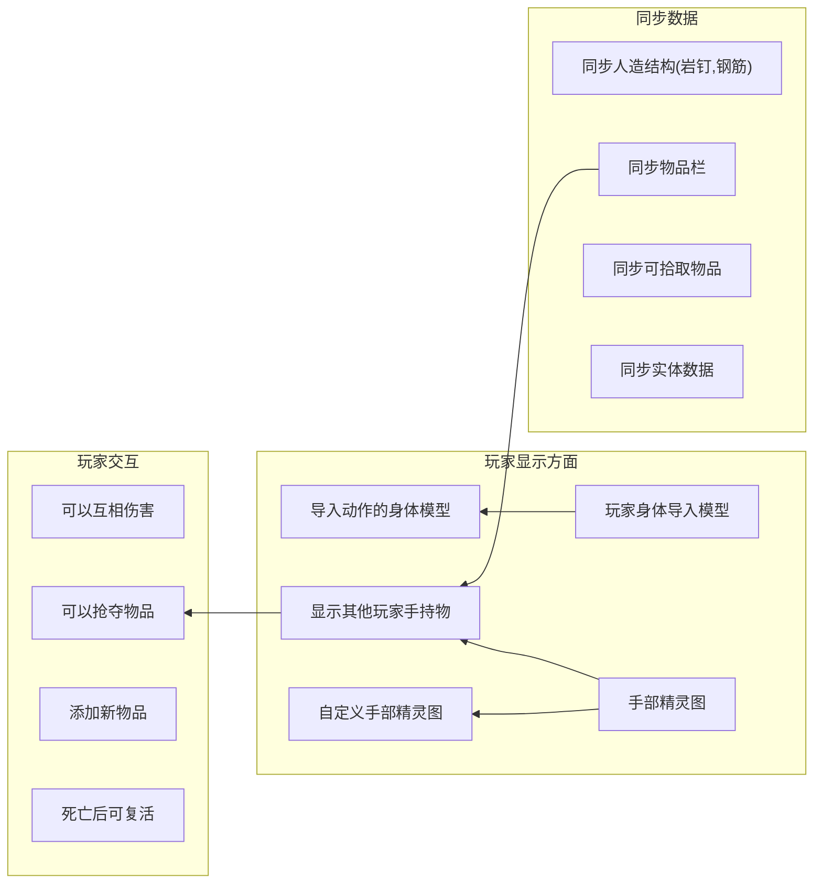

# White Knuckle Multi Player Mod - 白色节点联机MOD

**中文** | [English](README.md)

## 概述

这是一个为《白色节点》制作的 Unity MOD, 实现了简易联网玩家映射 (目前仅映射可抓握的玩家胶囊) .

 **重要声明** :

* **本人并非 Unity/C# 开发者, 日常工作不涉及此类开发.**
* 本项目中 **部分代码由 AI 生成** .
* 因此,  **部分代码质量可能非常糟糕** , 请谨慎参考.
* 联机功能相关的代码 **fork自之前存在的联机mod项目** .
* 对于使用此 MOD 进行开发、搭建联机端口可能带来的 **任何风险 (包括但不限于安全、稳定性问题) ** , 请 **自行评估并承担** .

 **存在的问题** :

* 对象生命周期混乱, 可能导致未预期的行为.
* 目前仅支持映射玩家胶囊, 其他物体尚未实现同步.
* 
 **可能的目标** :



---

## 安装MOD

在 [Releases](https://github.com/Shen-X-L/WKMultiMod/releases) 页面下载所需的 `.dll` 文件, 放入游戏目录下的 `BepInEx/plugins` 目录中即可.

## 快速开始

### 前提条件

1. **游戏** :《White Knuckle》b-0.52a
2. **框架** :[BepInEx](https://github.com/BepInEx/BepInEx) (请使用与游戏版本兼容的版本)

### 安装步骤

**bash**

```
# 1. 克隆此仓库到本地
git clone https://github.com/Shen-X-L/WKMultiMod.git

# 2. 构建 MOD
# 方法A: 使用 Visual Studio 打开并构建 WhiteKnuckleMod.sln
# 方法B: 使用命令行
dotnet build -c Release
```

### 手动安装

1. 将构建生成的 `WhiteKnuckleMod.dll` 文件复制到游戏目录的 `BepInEx\plugins\` 文件夹下.
2. 将依赖 `LiteNetLib.dll` 文件复制到游戏目录的 `BepInEx\plugins\` 文件夹下
3. 启动游戏, 检查 BepInEx 控制台或日志文件, 确认 MOD 已成功加载.

## 项目结构

**text**

```
WhiteKnuckleMod/
├──src/
│   ├─Component/
│   │   └─Component.cs              # 组件类,负责处理网络数据
│   ├─Core/
│   │   ├─LocalPlayerManager.cs     # 本地玩家信息打包类
│   │   ├─MPCore.cs                 # 核心类,负责主要事件处理
│   │   ├─MPMain.cs                 # 启动类,用来启动补丁
│   │   └─RemotePlayerManager.cs    # 远程玩家对象管理类
│   ├─Data/
│   │   └─PlayerData.cs             # 玩家网络数据定义 + 序列化工具类
│   ├─NetWork/
│   │   ├─MPLiteNet.cs              # 暂时废弃
│   │   ├─MPSteamworks.cs           # 拆分的steam网络逻辑类
│   │   └─NetworkEvents.cs          # 网络总线
│   ├─Patch/
│   │   └─Patch.cs                  # 补丁,实现拦截或注入
│   └─Util/                    
│       ├─TickTimer.cs              # Debug控制输出频率计数器
│       └─TypeConverter.cs          # 字符串转Bool工具
├── lib/                            # 外部依赖库目录 (需自行添加) 
│   └── README.md                   # 依赖库获取说明
├── WhiteKnuckleMod.sln             # Visual Studio 解决方案文件
├── WhiteKnuckleMod.csproj          # 项目配置文件
└── README.md                       # 本文档
```

## 开发指南

### 环境设置

1. **安装 .NET SDK** :从 [Microsoft .NET官网](https://dotnet.microsoft.com/) 下载并安装.
2. **恢复 NuGet 包** :在项目根目录执行 `dotnet restore`.
3. **获取游戏 DLL** :请务必按照 `lib/README.md` 中的说明, 获取必要的游戏 DLL 文件并放入 `lib/` 目录.

### 依赖库说明

本项目编译需要引用游戏本体的部分 DLL 文件 ( **这些文件受版权保护, 请勿提交至本仓库** ) , 主要包括:

* `Assembly-CSharp.dll`
* `UnityEngine.dll`
* `UnityEngine.CoreModule.dll`
* 等文件 (详见 `lib/README.md`) .

### 构建配置要点

项目文件 (`WhiteKnuckleMod.csproj`) 中已配置关键引用和构建目标, 确保 `TargetFramework` 为 `netstandard2.1` 并允许不安全代码.

## MOD 功能详情

## 联机功能

## 0.13/0.14

在游戏中开启作弊模式 (`cheats`) 后, 可使用以下命令:

* `host <名称> [最大玩家数]` - 创建大厅.
  * 示例:`host abcde`
* `getlobbyid` - 获取大厅大厅码
* `join <大厅码>` - 通过大厅码,加入大厅
  * 示例: `join 109775241951624817`
* `talk <文字(目前控制台不支持中文)>` - 来在头顶的标签上说话
  * 示例: `talk help me`
* `tpto <steamId(后缀匹配)>` - 进行玩家间tp
  * 示例 `tpto 22(目标id 561198279116422)` 

## 0.12

在游戏中开启作弊模式 (`cheats`) 后, 可使用以下命令:

* `host <端口号> [最大玩家数]` - 创建主机.
  * 示例:`host 22222`
* `join <IP地址> <端口号>` - 加入一个已创建的主机.
  * 示例:`join 127.0.0.1 22222` 或 `join [::1] 22222`
* `leave` - 离开当前连接的主机.

### 配置选项

shenxl.MultiPlayerMod.cfg 中
```
[Debug]

## 值为0时使用中文输出日志, Use English logs when the value is 1.
# Setting type: Int32
# 默认值: 1
LogLanguage = 0
```

## 贡献指南

欢迎提交 Issue 报告问题或提出建议！也欢迎 Pull Request 贡献代码.

 **再次提醒** :本项目代码质量参差不齐, 且部分为AI生成, 贡献时请注意.

### 贡献流程

1. Fork 本仓库.
2. 创建您的特性分支 (`git checkout -b feature/你的新功能`).
3. 提交您的更改 (`git commit -m '添加了某个功能'`).
4. 推送至分支 (`git push origin feature/你的新功能`).
5. 开启一个 Pull Request.

### 代码规范建议

* 尽量遵循 C# 通用命名约定.
* 关键部分可添加注释说明.
* 新功能请进行充分测试.

## 重要版权声明:

* 游戏本体及其相关的 DLL 文件版权归原游戏开发商所有.
* 使用本 MOD 需确保您已拥有合法的《白色节点》游戏副本.

## 致谢

* **[Harmony](https://github.com/pardeike/Harmony)** - 强大的 .NET 运行时补丁库.
* **[BepInEx](https://github.com/BepInEx/BepInEx)** - 优秀的 Unity 游戏插件框架.
* **《白色节点》游戏社区** - 提供的灵感和测试帮助.
* **原联机 MOD 作者** - 为其开源代码奠定了基础.

## 联系方式

* **GitHub Issues** : [在此提交问题或建议](https://github.com/%E4%BD%A0%E7%9A%84%E7%94%A8%E6%88%B7%E5%90%8D/%E4%BB%93%E5%BA%93%E5%90%8D/issues)
* **Discord** : [https://discord.com/invite/f2CqdmUSap](https://discord.com/invite/f2CqdmUSap)
* **QQ 群** : 596296577
* **作者** : Shenxl - 819452727@qq.com
