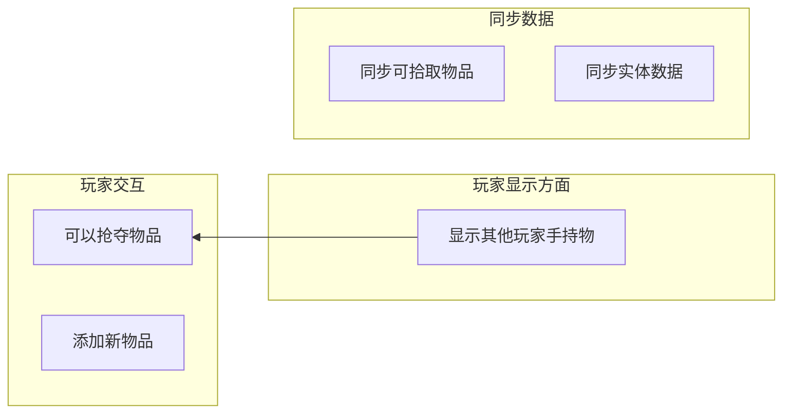

# White Knuckle Multi Player Mod - 白色节点联机MOD

**中文** | [English](README.md)

## 概述

这是一个为《白色节点》制作的 Unity MOD, 实现了简易联网玩家映射.

 **重要声明** :

* **本人并非 Unity/C# 开发者, 日常工作不涉及此类开发.**
* 本项目中 **部分代码由 AI 生成** .
* 因此,  **部分代码质量可能非常糟糕** , 请谨慎参考.
* 联机功能相关的代码 **fork自之前存在的联机mod项目** .

 **可能的目标** :


```mermaid
graph RL
    %% 模块 1:玩家显示方面
    subgraph 玩家显示方面
        1d[显示其他玩家手持物]
    end

    %% 模块 2:玩家交互
    subgraph 玩家交互
        2b[可以抢夺物品]
        2c[添加新物品]
    end

    %% 模块 3:同步数据
    subgraph 同步数据
        3c[同步可拾取物品]
        3e[同步实体数据]
    end

    %% 依赖关系连接 (跨模块和模块内)
    1d --> 2b
```

---

## 安装MOD

### 前提条件

1. **游戏** :《White Knuckle》
2. **框架** :[BepInEx](https://github.com/BepInEx/BepInEx) (请使用与游戏版本兼容的版本)

### 安装步骤

在 [Releases](https://github.com/Shen-X-L/WKMultiMod/releases) 页面下载所需的 `.zip` 文件, 放入游戏目录下的 `BepInEx/plugins` 目录中解压即可.

## MOD 功能详情

### 联机功能

### 1.5.0

新增命令:

* `host <名称> [大厅可见性] [最大玩家数]` - 创建大厅.大厅可见性可选值见 `lobbytype`命令
  * 示例:`host abcde` `host aaa friends 3`
* `join <名称/大厅码>` - 通过大厅名称或大厅码加入大厅,优先将参数匹配大厅名,如果有多个同名大厅会无法加入,请使用大厅码加入
  * 示例: `join abcde` `join 109775241951624817`
* `leave` - 离开当前连接的大厅.
* `lobbyid` - 获取大厅大厅码并复制到剪贴板
* `allplayer` - 获取全部玩家及其steamId
* `talk <文字(目前控制台不支持中文)>` - 来在头顶的标签上以及控制台说话
  * 示例: `talk hello` `talk I have the highland`
* `lobbylist` - 获取所有大厅信息,包括大厅码和当前玩家数
* `setlobbyname <名称>` - 修改大厅名称,只能房主使用
  * 示例: `setlobbyname newname`
* `changemodel <模型名称>` - 修改远程玩家模型(局内不生效),目前支持default和slugcat
  * 示例: `changemodel slugcat`
* `lobbytype [public/private/friends]` - 修改大厅可见类型,public为公开,private为私密(只能通过大厅码加入),friends为好友可见(只能被好友看到并加入)
  * 示例: `lobbytype friends`
* `invite` - 邀请好友加入大厅 (感谢Fugel提供的代码)
* `allowcheats` - 控制大厅内是否可以使用cheats命令,如果设置为false,强制关闭cheats和noclip状态
  * 示例: `allowcheats false` `allowcheats true`
* `allowpvp` - - 控制大厅内是否可以互相伤害
  * 示例: `allowpvp false` `allowpvp true`

在游戏中开启作弊模式 (`cheats`) 后, 可使用以下命令:

* `tpto <steamId(后缀匹配)>` - 进行玩家间tp,有自动补全
  * 示例: `tpto 16422 或 tpto 22(目标steamId 561198279116422)`

### 0.12(停止更新)

在游戏中开启作弊模式 (`cheats`) 后, 可使用以下命令:

* `host <端口号> [最大玩家数]` - 创建主机.
  * 示例:`host 22222`
* `join <IP地址> <端口号>` - 加入一个已创建的主机.
  * 示例:`join 127.0.0.1 22222` 或 `join [::1] 22222`
* `leave` - 离开当前连接的主机.

## 开发指南

### 源码构建

**bash**

```
# 1. 克隆此仓库到本地
git clone https://github.com/Shen-X-L/WKMultiMod.git

# 2. 构建 MOD
# 方法A: 使用 Visual Studio 打开并构建 WhiteKnuckleMod.sln
# 方法B: 使用命令行
dotnet build -c Release
```

### 项目结构

```
WhiteKnuckleMod/
├── src/Core/        # Mod核心逻辑
│   ├─ Asset/
│   │   └─ MPAssetManager.cs # 负责获取游戏本体预制体,通过Resources.FindObjectsOfTypeAll<GameObject>()寻找特定预制体
│   ├─ Component/            # 所有需要游戏本体库无法移至Unity项目的组件
│   │   ├─ LocalPlayer.cs    # 组件类,负责玩家本地位置
│   │   ├─ NetworkedPiton.cs # 组件类,负责岩钉同步
│   │   └─ RemoteEntity.cs   # 组件类,负责对其他玩家的伤害
│   ├─ Core/
│   │   ├─ MPConfig.cs           # 读取配置文件的数据
│   │   ├─ MPCore.cs             # 核心类,负责主要事件处理
│   │   ├─ MPGameModeManager.cs  # 负责定义可以网络传送的游戏模式数据和加载对应游戏模式
│   │   └─ MPMain.cs             # 启动类,用来启动补丁
│   ├─ Data/
│   │   ├─ DataReader.cs         # 读取ArraySegment<byte>/byte[]内部数据
│   │   ├─ DataWriter.cs         # 写入ArraySegment<byte>数据
│   │   ├─ MPDataPool.cs         # 管理每个线程独立的读写对象池,避免频繁分配内存
│   │   ├─ MPEventBusGame.cs     # 游戏内数据总线,负责游戏内事件的发布和订阅
│   │   └─ MPEventBusNet.cs      # 网络数据总线,负责MPCore和MPSteamworks交流
│   ├─ NetWork/
│   │   ├─ MPLiteNet.cs          # 通过IP连接 暂时废弃
│   │   ├─ MPPacketHandler.cs    # 处理接收数据包的类,根据协议分发数据
│   │   ├─ MPPacketRouter.cs     # 通过反射构建 包类型-处理函数字典 根据包类型调用对应的处理函数
│   │   └─ MPSteamworks.cs       # 拆分的steam网络逻辑类
│   ├─ Patch/
│   │   ├─ Patch.cs                  # 补丁,一些离散的补丁功能,如通过解锁进度,禁用翻转实现地图同步
│   │   ├─ Patch_CommandConsole.cs   # 补丁,注册指令,停止作弊,修复string类型再控制台输出
│   │   ├─ Patch_ENT_Player.cs       # 补丁,获取玩家的事件
│   │   ├─ Patch_PitonSync.cs        # 补丁,获取岩钉的事件
│   │   └─ Patch_SteamManager.cs     # 补丁,通过SteamManager的生命周期来初始化MPCore
│   ├─ RemotePlayer/
│   │   ├─ Factory/
│   │   │   ├─ BaseRemoteFactory.cs  # 远程对象工厂基类,提供创建远程对象的接口,通过复制预制体创建远程玩家对象
│   │   │   └─ SlugcatFactory.cs     # 对蛞蝓猫预制体模型进行特殊处理的工厂类
│   │   ├─ RPContainer.cs        # 负责单个远程玩家对象的数据更新和生命周期
│   │   ├─ RPFactoryManager.cs   # 负责创建远程玩家对象,并将其添加到RPManager中管理
│   │   └─ RPManager.cs          # 管理全部远程玩家对象的数据更新和生命周期
│   ├─ Test/
│   │   ├─ Test.cs               # 不影响游戏的测试函数,可以快速修改
│   │   └─ TestMonoSingleton.cs  # 测试用的MonoSingleton,可以快速修改
│   ├─ UI/ 
│   │   ├─ Patch_UI.cs               # 补丁,游戏模式菜单初始化时添加Multi play按钮
│   │   ├─ UI_LoadingDisplay.cs      # Loading界面组件,实现定时消失,立刻消失,延迟消失
│   │   ├─ UI_LobbyCreateButton.cs   # 创建大厅按钮组件,负游戏模式菜单中责快速创建大厅并开始游戏按钮的功能
│   │   ├─ UI_LobbyButton.cs         # 大厅选项按钮组件,负责加入大厅界面按钮的功能
│   │   ├─ UI_LobbyListPane.cs       # 大厅列表面板组件,负责显示大厅列表界面
│   │   └─ UI_Manager.cs		        # UI管理器,负责创建和管理UI界面
│   ├─ Util/ 
│   │   ├─ Localization/   
│   │   │   ├─ Localization.cs   # 本地化工具类,获取本地化控制台文本
│   │   │   ├─ json_sort.py      # 用于将Localization文件夹下的json文件排序和对比
│   │   │   ├─ texts_en.json     # 英文文本
│   │   │   └─ texts_zh.json     # 中文文本
│   │   ├─ MonoSingleton.cs      # Unity组件单例基类,提供在Unity中使用的单例模式实现
│   │   └─ Singleton.cs          # 普通单例基类,提供普通的单例模式实现
│   ├─ World/
│   │   └─ PitonSyncManager.cs   # 负责岩钉创建,移动,掉落事件的同步
│   └─ LocalPaths.props.example  # 配置文件,负责构建项目的库引用地址独立
├── src/Shared/      # 提取的Unity组件逻辑,用于共享到unity项目快速构建预制体
│   ├─ Component/    # 可以在Unity项目使用的组件
│   │   ├─ LookAt.cs         # 让标签强制面向玩家,缩放标签使大小不变
│   │   ├─ ObjectIdentity.cs # 标识该对象的创建工厂Id,用于对象正确销毁
│   │   ├─ RemoteHand.cs     # 通过网络数据控制手部位置
│   │   ├─ RemotePlayer.cs   # 通过网络数据控制玩家位置
│   │   ├─ RemoteTag.cs      # 通过网络数据控制标签内容
│   │   └─ SimpleArmIK.cs    # 通过IK使胳膊连接到手
│   ├─ Data/ 
│   │   ├─ HandData.cs           # 手部位置数据
│   │   └─ PlayerData.cs         # 玩家位置数据
│   ├─ MK_Component/     # 游戏内的组件,无法直接赋予,通过映射组件处理
│   │   ├─ MK_CL_Handhold.cs     # 游戏内CL_Handhold的映射
│   │   ├─ MK_ObjectTagger.cs    # 游戏内ObjectTagger的映射
│   │   └─ MK_RemoteEntity.cs    # Mod的RemoteEntity的映射
│   ├─ Util/ 
│   │   ├─ DictionaryExtensions.cs   # 字典工具类,有后缀匹配,字典做差等功能
│   │   └─ TickTimer.cs              # Debug控制输出频率计数器
│   └─ LocalPaths.props.example # 配置文件,负责构建项目的库引用地址独立
├── lib/                            # 外部依赖库目录 (需自行添加) 
├── WhiteKnuckleMod.sln             # Visual Studio 解决方案文件
└── README.md                       # 本文档
```

### 环境设置

1. **安装 .NET SDK** :从 [Microsoft .NET官网](https://dotnet.microsoft.com/) 下载并安装.
2. **恢复 NuGet 包** :在项目根目录执行 `dotnet restore`.
3. **获取游戏 DLL** :请务必按照 `lib/README.md` 中的说明, 获取必要的游戏 DLL 文件并放入 `lib/` 目录.

## 贡献指南

欢迎提交 Issue 报告问题或提出建议！也欢迎 Pull Request 贡献代码.

 **再次提醒** :本项目代码质量参差不齐, 且部分为AI生成, 贡献时请注意.

### 贡献流程

1. Fork 本仓库.
2. 创建您的特性分支 (`git checkout -b feature/你的新功能`).
3. 提交您的更改 (`git commit -m '添加了某个功能'`).
4. 推送至分支 (`git push origin feature/你的新功能`).
5. 开启一个 Pull Request.

### 代码规范建议

* 尽量遵循 C# 通用命名约定.
* 关键部分可添加注释说明.
* 新功能请进行充分测试.

## 重要版权声明:

* 游戏本体及其相关的 DLL 文件版权归原游戏开发商所有.
* 使用本 MOD 需确保您已拥有合法的《白色节点》游戏副本.

## 致谢

* **[Harmony](https://github.com/pardeike/Harmony)** - 强大的 .NET 运行时补丁库.
* **[BepInEx](https://github.com/BepInEx/BepInEx)** - 优秀的 Unity 游戏插件框架.
* **[Time](https://github.com/TimeCr)** - 实现大量功能,岩钉同步,掉落物同步,实体同步(部分功能还在测试)
* **[Fugel](https://github.com/PotatoeShaman)** - 提供Steam邀请好友,收到邀请等API,局内UI显示
* 可喵 - 提供mod新封面
* **《白色节点》游戏社区** - 提供的灵感和测试帮助.
* **原联机 MOD 作者** - 为其开源代码奠定了基础.
* **QQ 群和Discord** - 提供bug反馈,mod改进想法

## 联系方式

* **GitHub Issues** : [在此提交问题或建议](https://github.com/%E4%BD%A0%E7%9A%84%E7%94%A8%E6%88%B7%E5%90%8D/%E4%BB%93%E5%BA%93%E5%90%8D/issues)
* [**White Knuckle Discord**](https://discord.com/invite/f2CqdmUSap)
* [**联机Mod Discord**](https://discord.gg/huHkf6ChcV)
* **QQ 群** : 596296577
* **作者** : Shenxl - 819452727@qq.com
