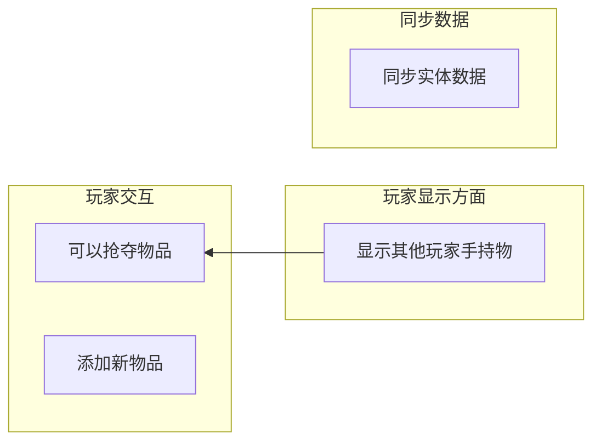

# White Knuckle Multi Player Mod - 白色节点联机MOD

**中文** | [English](README.md)

## 概述

这是一个为《白色节点》制作的 Unity MOD, 实现了简易联网玩家映射.

**重要声明** :

* **本人并非 Unity/C# 开发者, 日常工作不涉及此类开发.**
* 本项目中 **部分代码由 AI 生成** .
* 因此,  **部分代码质量可能非常糟糕** , 请谨慎参考.
* 联机功能相关的代码 **fork自之前存在的联机mod项目** .

**可能的目标** :


```mermaid
graph RL
    %% 模块 1:玩家显示方面
    subgraph 玩家显示方面
        1d[显示其他玩家手持物]
    end

    %% 模块 2:玩家交互
    subgraph 玩家交互
        2b[可以抢夺物品]
        2c[添加新物品]
    end

    %% 模块 3:同步数据
    subgraph 同步数据
        3e[同步实体数据]
    end

    %% 依赖关系连接 (跨模块和模块内)
    1d --> 2b
```

---

## 安装MOD

### 前提条件

1. **游戏** :《White Knuckle》
2. **框架** :[BepInEx](https://github.com/BepInEx/BepInEx) (请使用与游戏版本兼容的版本)

### 安装步骤

在 [Releases](https://github.com/Shen-X-L/WKMultiMod/releases) 页面下载所需的 `.zip` 文件, 放入游戏目录下的 `BepInEx/plugins` 目录中解压即可.

## MOD 功能详情

### 联机功能

### 1.7.0

新增命令:

* `bindsync [true|false]` - 控制之后加入的玩家是否饰品和绑定同步
  * 示例: `bindsync true`

* `teamrule <生效队伍名称> <目标队伍名称> ([启用规则] [true|false|default])*n , ...` - 控制队伍间规则
  * 示例: `teamrule hunter runner pvp true hang false grab false , runner hunter pvp false tagshow false`

* `teamrule` 启用规则:
  * `pvp` - 是否可以伤害对方,`hang` - 是否可以拖拽对方(像拽箱子一样),`grab` - 是否可以抓取对方(像岩钉一样)
  * `tagshow` - 是否显示头顶标签,`collision` - 是否开启碰撞
  * `syncitem` - 是否同步道具(未实现),`syncinventory` - 是否同步背包(未实现),`syncdied` - 死亡同步(一人死亡所有人死亡)

* `addteam <队伍名称>` - 添加活跃队伍
* `removeteam <队伍名称>` - 删除活跃队伍并关闭其规则
* `jointeam <队伍名称>` - 加入一个队伍
* `setname <名称>` - 设置额外的名称
* `playercolor <预设>/<RGB 值>` - 设置玩家颜色
  * 示例: `playercolor white` - 设置为白色 `playercolor 255 255 255` - 通过RGB设置为白色

* `pcmd <all|steamId> ; [命令1] ; [命令2]...` - 让其他远程玩家执行你输入的命令
  * 示例: `pcmd 561198279116422 12345 ; addperk perk_u_t3_peripheralbinding ; spawnentity item_artifact_evaglove`

* `tcmd <队伍名称> ; [命令1] ; [命令2]...` - 让队伍内当前玩家执行你输入的命令
  * 示例: `tcmd hunter ; addperk perk_u_t3_peripheralbinding ; spawnentity item_artifact_rebar_return`
  * 示例: `tcmd runner ; addperk perk_u_t3_peripheralbinding ; spawnentity item_artifact_evaglove`

* `acmd <join|restart|jointeam_TeamName> ; [命令1] ; [命令2]...` - 在玩家进行某些操作时执行你输入的命令
  * `acmd` 注入时机:
    * `join` - 加入房间并初始化地图后会执行该命令,`restart` - 玩家彻底死亡的重开或restart按钮后会执行该命令
    * `jointeam_TeamName` - 加入该队伍时会执行该命令(目前没有持久化,每次重开需要重新设置)
    * 示例: `acmd join ; loadlevel xxx ; delay 1s ; deathgoo-height NaN ;`
    * 示例: `acmd restart ; addperk perk_u_t3_peripheralbinding ; spawnentity item_artifact_evaglove`
  * 示例: `acmd jointeam_hunter ; addperk perk_u_t3_peripheralbinding ; spawnitem item_artifact_evaglove`

**自定义加入/离开/死亡/胜利信息:**
**死亡信息编辑:**
编辑`texts_(本地语言).json`中的`0_DeathMessage`
* 其中由游戏本体造成的伤害中`{0}`是本地玩家名,json键为死因,并非必须使用
* 由其他远程玩家造成的伤害中`{0}`是本地玩家名,`{1}`是攻击者玩家名,json键为`playerKill`+死因,并非必须使用

```ini
"0_DeathMessage": {
  "default": [
    "{0} died due to {1}"
  ],
  "teeth": [
    "{0} 被teeth大口大口嚼嚼嚼了"
  ],
  "fan": [
    "{0} 被风扇绞成两半了"
  ],
  "死因":[
    "{0}的自定义的死亡信息"
  ],
  "playerKillreturnrebar": [
    "{1}: {0} 你对神矛不够虔诚,我要杀了你"
  ],
  "playerKill死因":[
    "{0}被{1}杀的自定义的死亡信息"
  ]
},


```

**加入/离开/胜利信息编辑:**
编辑texts_(本地语言).json中的0_DisplayMessage的
* `EnteredMessages` – 加入时在本地玩家显示的信息 
* `InviteReceivedMessages` – 邀请他人时显示的信息 
* `JoinMessages` – 加入大厅时显示的信息 
* `LeaveMessages` – 离开大厅时显示的信息 
* `WinMessages` – 胜利时显示的信息 
其中{0}是玩家名

```ini
"0_DisplayMessage": {
  "EnteredMessages": [
    "加入 {0} - {1}/{2}\nid: {3}"
  ],
  "InviteReceivedMessages": [
    "{0} 已被邀请到设施"
    "自定义的邀请他人信息"
  ],
  "JoinMessages": [
    "{0} 因为Δ异常卷入了这个世界",
    "{0} 以被本设施雇佣",
    "{0} 从mass中逃脱出来",
    "{0} 被ρ召唤到这里"
    "自定义的加入信息"
  ],
  "LeaveMessages": [
    "{0} 因为Δ异常脱离了这个世界",
    "{0} 以被本设施解雇",
    "{0} 被mass重新吞噬了",
    "{0} 被ρ重新带走了"
    "自定义的离开信息"
  ],
  "WinMessages": [
    "{0} 逃出生天"
    "自定义的胜利信息"
  ]
},

```

### 1.5.x

新增命令:

* `host <名称> [大厅可见性] [最大玩家数]` - 创建大厅.大厅可见性可选值见 `lobbytype`命令

   * 示例:`host abcde` `host aaa friends 3`

* `join <名称|大厅码>` - 通过大厅名称或大厅码加入大厅,优先将参数匹配大厅名,如果有多个同名大厅会无法加入,请使用大厅码加入

   * 示例: `join abcde` `join 109775241951624817`

* `leave` - 离开当前连接的大厅.
* `lobbyid` - 获取大厅大厅码并复制到剪贴板
* `allplayer` - 获取全部玩家及其steamId
* `talk <文字(目前控制台不支持中文)>` - 来在头顶的标签上以及控制台说话

   * 示例: `talk hello` `talk I have the highland`

* `lobbylist` - 获取所有大厅信息,包括大厅码和当前玩家数
* `setlobbyname <名称>` - 修改大厅名称,只能房主使用

   * 示例: `setlobbyname newname`

* `changemodel <模型名称>` - 修改远程玩家模型,目前支持default和slugcat

   * 示例: `changemodel slugcat`

* `lobbytype [public|private|friends]` - 修改大厅可见类型,public为公开,private为私密(只能通过大厅码加入),friends为好友可见(只能被好友看到并加入)

   * 示例: `lobbytype friends`

* `invite` - 邀请好友加入大厅 (感谢Fugel提供的代码)
* `allowcheats [true|false]` - 控制大厅内是否可以使用cheats命令,如果设置为false,强制关闭cheats和noclip状态

   * 示例: `allowcheats false` `allowcheats true`

* `allowpvp [true|false]` - 控制大厅内是否可以互相伤害

   * 示例: `allowpvp false` `allowpvp true`

在游戏中开启作弊模式 (`cheats`) 后, 可使用以下命令:

* `tpto <steamId(后缀匹配)>` - 进行玩家间tp,有自动补全
   * 示例: `tpto 16422 或 tpto 22(目标steamId 561198279116422)`

### 0.12(停止更新)

在游戏中开启作弊模式 (`cheats`) 后, 可使用以下命令:

* `host <端口号> [最大玩家数]` - 创建主机.

   * 示例:`host 22222`

* `join <IP地址> <端口号>` - 加入一个已创建的主机.

   * 示例:`join 127.0.0.1 22222` 或 `join [::1] 22222`

* `leave` - 离开当前连接的主机.

## 开发指南

### 源码构建

**bash**

```ini
# 1. 克隆此仓库到本地
git clone https://github.com/Shen-X-L/WKMultiMod.git

# 2. 构建 MOD
# 方法A: 使用 Visual Studio 打开并构建 WhiteKnuckleMod.sln
# 方法B: 使用命令行
dotnet build -c Release


```

### 项目结构

```ini
WhiteKnuckleMod/
├── src/Core/        # Mod核心逻辑
│   ├─ Asset/
│   │   └─ MPAssetManager.cs # 负责获取游戏本体预制体,通过Resources.FindObjectsOfTypeAll<GameObject>()寻找特定预制体
│   ├─ Component/            # 所有需要游戏本体库无法移至Unity项目的组件
│   │   ├─ LocalPlayer.cs           # 玩家本地位置上传
│   │   ├─ NetworkedClimableItem.cs # 玩家生成可攀爬物同步
│   │   ├─ NetworkedItem.cs		    # 玩家生成物品同步
│   │   ├─ RemoteEntity.cs          # 对其他玩家的伤害,让用远程玩家对象可被拖拽/攻击
│   │   ├─ RemoteHand.cs            # 玩家生成手部位置同步,和远程玩家拖拽本地玩家
│   │   └─ RPContainerRef.cs        # 远程玩家对象容器组件,用来在远程玩家对象上标识和获取RPContainer
│   ├─ Core/
│   │   ├─ MPConfig.cs              # 读取配置文件的数据
│   │   ├─ MPCore.cs                # 核心类,负责主要事件处理
│   │   ├─ MPGameModeManager.cs     # 负责定义可以网络传送的游戏模式数据和加载对应游戏模式
│   │   └─ MPMain.cs                # 启动类,用来启动补丁
│   ├─ Data/
│   │   ├─ MPDataPool.cs        # 管理每个线程独立的读写对象池,避免频繁分配内存
│   │   ├─ MPEventBusGame.cs    # 游戏内数据总线,负责游戏内事件的发布和订阅
│   │   ├─ MPEventBusNet.cs     # 网络数据总线,负责MPCore和MPSteamworks交流
│   │   ├─ MPKeys.cs            # 定义常用常量字符串,如大厅数据键,玩家数据事件等
│   │   └─ TeamRuleManager.cs   # 负责管理队伍规则,根据配置文件设置玩家是否可以互相伤害等规则
│   ├─ NetWork/
│   │   ├─ MPLiteNet.cs          # 通过IP连接 暂时废弃
│   │   ├─ MPPacketHandler.cs    # 处理接收数据包的类,根据协议分发数据
│   │   ├─ MPPacketRouter.cs     # 通过反射构建 包类型-处理函数字典 根据包类型调用对应的处理函数
│   │   └─ MPSteamworks.cs       # 拆分的steam网络逻辑类
│   ├─ Patch/                       # 补丁类和一些反射工具,通过Harmony实现对游戏本体的修改和事件获取
│   │   ├─ Patch.cs                 # 一些离散的补丁功能,如通过解锁进度,禁用翻转实现地图同步
│   │   ├─ Patch_CL_GameManager.cs  # 处理世界偏移带来的偏移量
│   │   ├─ Patch_CL_Prop.cs         # 关闭大部分CL_Prop原本功能,让其仅保持可被拖拽的功能
│   │   ├─ Patch_ClimbableItem.cs   # 处理可攀爬物品的事件
│   │   ├─ Patch_CommandConsole.cs  # 注册指令,提供控制台命令反射接口
│   │   ├─ Patch_ENT_Player.cs      # 获取玩家的事件,强制玩家松手
│   │   ├─ Patch_ItemSync.cs        # 物品的同步
│   │   ├─ Patch_SteamManager.cs    # 通过SteamManager的生命周期来初始化MPCore
│   │   └─ Patch_WorldLoader.cs     # 停止复活时的种子偏移,同步支线生成的坐标偏移
│   ├─ RemotePlayer/
│   │   ├─ Factory/
│   │   │   ├─ DefaultModelExtension.cs     # 负责默认模型预制体的工厂类
│   │   │   ├─ ICustomModelExtension.cs     # 提供加载模型预制体/资源的接口
│   │   │   ├─ RPPrefabProcessor.cs	        # 负责远程玩家预制体的后处理,如添加组件,修改材质等
│   │   │   └─ SlugcatModelExtension.cs     # 对蛞蝓猫预制体模型进行特殊处理的工厂类
│   │   ├─ RPContainer.cs       # 负责单个远程玩家对象的数据更新和生命周期
│   │   ├─ RPFactoryManager.cs  # 负责创建远程玩家对象,并将其添加到RPManager中管理
│   │   └─ RPManager.cs         # 管理全部远程玩家对象的数据更新和生命周期
│   ├─ UI/ 
│   │   ├─ Patch_UI.cs              # 补丁,游戏模式菜单初始化时添加Multi play按钮
│   │   ├─ UI_LoadingDisplay.cs     # Loading界面组件,实现定时消失,立刻消失,延迟消失
│   │   ├─ UI_LobbyCreateButton.cs  # 创建大厅按钮组件,负游戏模式菜单中责快速创建大厅并开始游戏按钮的功能
│   │   ├─ UI_LobbyJoinButton.cs    # 大厅选项按钮组件,负责加入大厅界面按钮的功能
│   │   ├─ UI_LobbyListPane.cs      # 大厅列表面板组件,负责显示大厅列表界面
│   │   └─ UI_Manager.cs		    # UI管理器,负责创建和管理UI界面
│   ├─ Util/ 
│   │   ├─ Localization/   
│   │   │   ├─ Localization.cs  # 本地化工具类,获取本地化控制台文本
│   │   │   ├─ json_sort.py     # 用于将Localization文件夹下的json文件排序和对比
│   │   │   ├─ texts_en.json    # 英文文本
│   │   │   └─ texts_zh.json    # 中文文本
│   │   ├─ MonoSingleton.cs         # Unity组件单例基类,提供在Unity中使用的单例模式实现
│   │   ├─ NestedCommandEngine.cs   # 控制台命令引擎,支持嵌套命令,自动补全等功能
│   │   └─ Singleton.cs             # 普通单例基类,提供普通的单例模式实现
│   ├─ World/
│   │   ├─ ClimbableItemSyncManager # 负责玩家生成可攀爬物创建,移动,掉落事件的同步
│   │   └─ ItemSyncManager.cs       # 负责玩家生成物品创建,移动,掉落事件的同步
│   ├─ LocalPaths.props             # 配置文件,负责构建项目的库引用地址独立
│   └─ LocalPaths.props.example     # 配置文件,负责构建项目的库引用地址独立
├── src/Shared/     # 提取的Unity组件逻辑,用于共享到unity项目快速构建预制体
│   ├─ Component/   # 可以在Unity项目使用的组件
│   │   ├─ LookAt.cs            # 让标签强制面向玩家,缩放标签使大小不变
│   │   ├─ ObjectIdentity.cs    # 标识该对象的创建工厂Id,用于对象正确销毁
│   │   ├─ RemotePlayer.cs      # 通过网络数据控制玩家位置
│   │   ├─ RemoteTag.cs         # 通过网络数据控制标签内容
│   │   └─ SimpleArmIK.cs       # 通过IK使胳膊连接到手
│   ├─ Data/ 
│   │   ├─ DataReader.cs        # 读取ArraySegment<byte>/byte[]内部数据
│   │   ├─ DataWriter.cs        # 写入ArraySegment<byte>数据
│   │   ├─ INetSerializable.cs  # 定义网络可序列化接口,实现接口的类可以被自动序列化和反序列化
│   │   └─ PlayerData.cs        # 玩家位置数据
│   ├─ MK_Component/    # 游戏内的组件,无法直接赋予,通过映射组件处理
│   │   ├─ MK_CL_Handhold.cs    # 游戏内CL_Handhold的映射
│   │   ├─ MK_ObjectTagger.cs   # 游戏内ObjectTagger的映射
│   │   ├─ MK_RemoteEntity.cs   # Mod的RemoteEntity的映射
│   │   └─ MK_RemoteHand.cs     # Mod的RemoteHand的映射
│   ├─ Util/ 
│   │   ├─ DictionaryExtensions.cs  # 字典工具类,有后缀匹配,字典做差等功能
│   │   └─ TickTimer.cs             # Debug控制输出频率计数器
│   ├─ LocalPaths.props             # 配置文件,负责构建项目的库引用地址独立
│   └─ LocalPaths.props.example     # 配置文件,负责构建项目的库引用地址独立
├── WhiteKnuckleMod.sln             # Visual Studio 解决方案文件
└── README_CN.md                    # 本文档


```

### 环境设置

1. **安装 .NET SDK** :从 [Microsoft .NET官网](https://dotnet.microsoft.com/) 下载并安装.
2. **恢复 NuGet 包** :在项目根目录执行 `dotnet restore`.
3. **获取游戏 DLL** :请务必按照 `lib/README.md` 中的说明, 获取必要的游戏 DLL 文件并放入 `lib/` 目录.

## 贡献指南

欢迎提交 Issue 报告问题或提出建议！也欢迎 Pull Request 贡献代码.

**再次提醒** :本项目代码质量参差不齐, 且部分为AI生成, 贡献时请注意.

### 贡献流程

1. Fork 本仓库.
2. 创建您的特性分支 (`git checkout -b feature/你的新功能`).
3. 提交您的更改 (`git commit -m '添加了某个功能'`).
4. 推送至分支 (`git push origin feature/你的新功能`).
5. 开启一个 Pull Request.

### 代码规范建议

* 尽量遵循 C# 通用命名约定.
* 关键部分可添加注释说明.
* 新功能请进行充分测试.

## 重要版权声明:

* 游戏本体及其相关的 DLL 文件版权归原游戏开发商所有.
* 使用本 MOD 需确保您已拥有合法的《白色节点》游戏副本.

## 致谢

* **[Harmony](https://github.com/pardeike/Harmony)** - 强大的 .NET 运行时补丁库.
* **[BepInEx](https://github.com/BepInEx/BepInEx)** - 优秀的 Unity 游戏插件框架.
* **[Time](https://github.com/TimeCr)** - 实现大量功能,岩钉同步,掉落物同步,实体同步(部分功能还在测试)
* **[Fugel](https://github.com/PotatoeShaman)** - 提供Steam邀请好友,收到邀请等API,局内UI显示
* 可喵 - 提供mod新封面
* **《白色节点》游戏社区** - 提供的灵感和测试帮助.
* **原联机 MOD 作者** - 为其开源代码奠定了基础.
* **QQ 群和Discord** - 提供bug反馈,mod改进想法

## 联系方式

* **GitHub Issues** : [在此提交问题或建议](https://github.com/%E4%BD%A0%E7%9A%84%E7%94%A8%E6%88%B7%E5%90%8D/%E4%BB%93%E5%BA%93%E5%90%8D/issues)
* [**White Knuckle Discord**](https://discord.com/invite/f2CqdmUSap)
* [**联机Mod Discord**](https://discord.gg/huHkf6ChcV)
* **QQ 群** : 596296577
* **作者** : Shenxl - 819452727@qq.com
